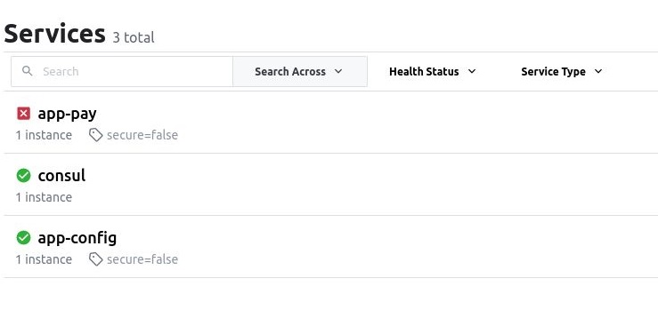
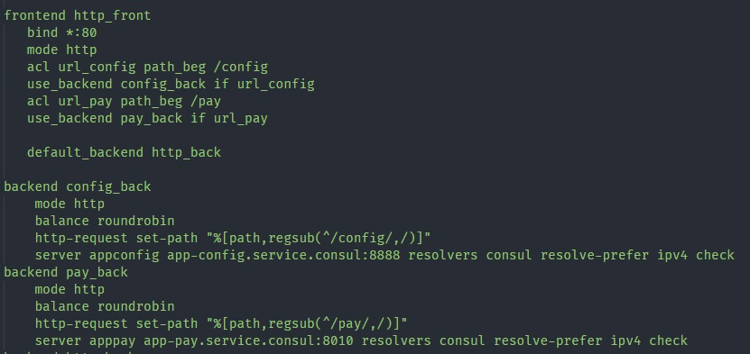
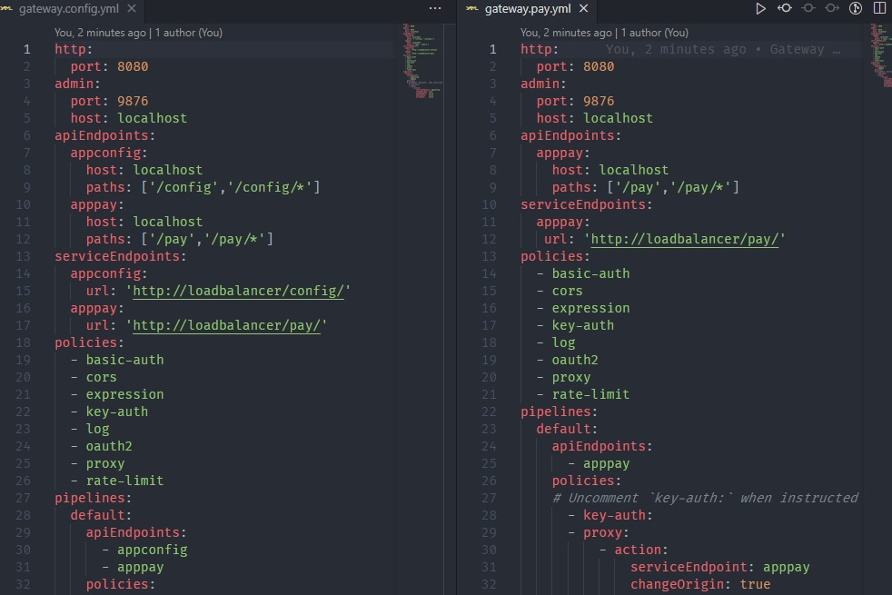

# Workshop4

Integrate microservice app-pay to:
- Consul

- Modify LoadBalancer to support path /pay pointing to app-pay microservice 

- Modify API GW to support redirect to app-pay microservice

till Martes 22/ 11:59pm 
-----------------------------------

Entregaron a tiempo:  
- SEbastian Garcia acosta
- Lina Acosta
- Cesar Canales
- Camilo ENriquez

Se pasaron del tiempo
- Javier TOrres
- Nelson David QUiñonez
- Christion GIronza 

