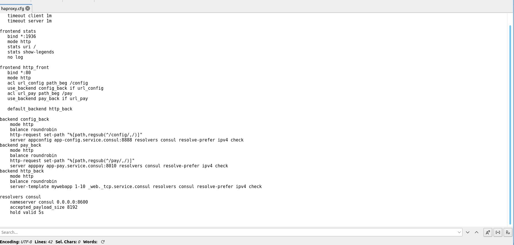

# Workshop4
Cesar Canales A00345026

Integrate microservice app-pay to:
- Consul

- Modify LoadBalancer to support path /pay pointing to app-pay microservice 

- Modify API GW to support redirect to app-pay microservice

till Martes 22/ 11:59pm 

